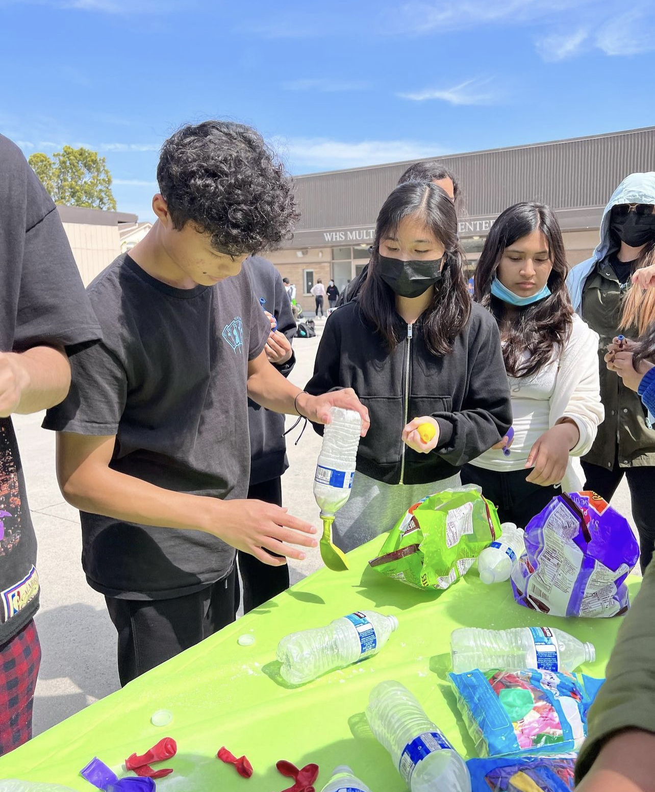
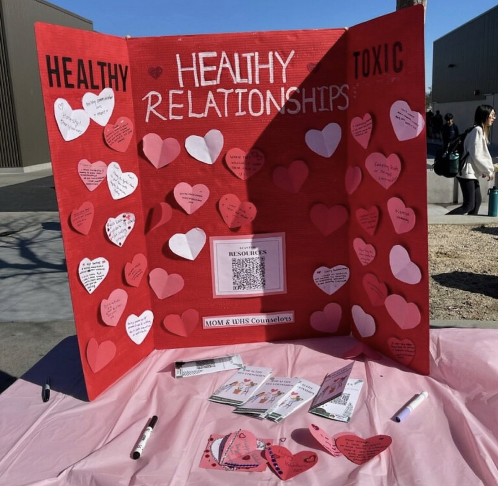

<!DOCTYPE html>
<html lang="en">
<head>
<meta charset="UTF-8">
<meta name="viewport" content="width=device-width, initial-scale=1.0">
<title>Mind Over Matter</title>
<link rel="stylesheet" href="styleshome.css"> <!-- Link to your CSS file for styling -->
</head>
<body>

<h1>Mind Over Matter</h1>
<ul>
<li><a href="#about">About Us</a></li>
<li><a href="#recommendations">Recommendations</a></li>
<li><a href="#resources">Resources</a></li>
<li><a href="#events">Events</a></li>
<li><a href="#contact">Contact</a></li>
</ul>

    <h2>Welcome to Mind Over Matter, Whitney's Mental Health Club</h2>
    
We, Mind over Matter, strive to provide a stress-free environment for students and raise awareness about mental health to eliminate stigmatization.

    <a href="#about" class="btn" style="padding-top: 5px;">Learn More</a>

    

        <h2>About Us</h2>
            <h3>Who We Are</h3>
            
Mind Over Matter is Whitney’s only mental health club that wants to bring more awareness toward teaching people how to take care of their mental health, as well as educating them about the various mental disorders. Ultimately we want to more people to become interested in learning about the vast field of mental health. 

            <h3>Why Mental Health is Important</h3>
            
Mental health is essential to learning how to cope with the stresses of your life, while maintaining your emotional and physical health. Learning about how to improve your mental health, and learning strategies to keep yourself from burning out can improve your psychological and social well-being. Taking care of your mental health is just an important as taking care of your physical health because they go hand in hand. When you lack sleep, or feel stressed your body starts to process things slower, and it’s harder to get through the day. Recognizing the problem in your routine is the first step, and the next step is to change something each day which can improve your sleeping habits. Whether it’s taking longer naps, sleeping early, or drinking a warm glass of milk before bed. Mental health also educates the public about different mental health disorders and the facts about each disorder, rather than the stigmatized “facts”.

            <h3>What We Do</h3>
            
Our mission is to offer a range of services, including counseling and therapy, workshops, support groups, and community outreach, to help individuals on their mental health journey.

    

    

        <h2>Upcoming Events</h2>
        

            <h3>Suicide Prevention Awareness Collab with P&B and Mental Health Counselors</h3>
            
Date: September 27, 2023

            
Location: Quad in Whitney High School

        

        

            <h3>Pumpkin Painting Collab with Key Club</h3>
            
Date: October 17, 2023

            
Location: Quad in Whitney High School

        

        <h2 style="padding-top:10px;">Past Events</h2>
        

            <h3>Slime Stress Balls Activity</h3>
            
Date: September 19, 2023

            
Location: Quad in Whitney High School

        

        

            <h3>Positive Affirmations Poster Activity</h3>
            
Date: September 12, 2023

            
Location: Quad in Whitney High School

        

        

            <h3>Plant Propagating</h3>
            
Date: September 6, 2023

            
Location: Quad in Whitney High School

        

    

    

        <h2>Our Recommendations</h2>
        <h3>Books</h3>
        <ul>
            <li><a target="_blank" href="https://www.google.com/search?q=rising+strong+book&client=safari&sca_esv=568744667&hl=en-us&sxsrf=AM9HkKk-p1ucMmYD_Z3i-OuZxqTVnbhpLQ:1695795781120&ei=RcoTZaaCB4bCkPIPg4mRyAI&gs_ssp=eJzj4tVP1zc0TDbOMyouKDM3YPQSKsoszsxLVyguKcoHUkn5-dkAwnULpg&oq=Rising+strong+%C2%A0book&gs_lp=EhNtb2JpbGUtZ3dzLXdpei1zZXJwIhRSaXNpbmcgc3Ryb25nIMKgYm9vayoCCAAyCBAuGIoFGJECMgUQABiABDIGEAAYBxgeMggQABgHGB4YCjIFEAAYgAQyBBAAGB4yBBAAGB4yBhAAGAUYHkikS1CWEFiFQXABeAGQAQCYAeYCoAGxF6oBCDUuMTIuMi4xuAEByAEA-AEBwgIKEAAYRxjWBBiwA8ICChAAGIoFGLADGEPCAhAQLhiKBRjIAxiwAxhD2AEBwgIIEAAYigUYkQLCAgwQLhgHGB4YxwEY0QPCAgQQIxgnwgIHECMYigUYJ8ICBxAuGIoFGEPCAgcQABiKBRhDwgIOEAAYigUYsQMYgwEYkQLCAg0QuQEYigUY7wQYChhDwgIHEC4YDRiABMICChAuGIAEGBQYhwLCAgcQABgNGIAEwgINEAAYCBgHGB4Y8QQYCsICCBAAGAUYBxge4gMEGAAgQYgGAZAGDroGBAgBGAg&sclient=mobile-gws-wiz-serp">Rising Strong</li>
            <li><a target="_blank" href="https://www.google.com/search?q=don't+believe+everything+you+think+vook&ie=UTF-8&oe=UTF-8&hl=en-us&client=safari">Don't Believe Everything You Think</a></li>
            <li><a target="_blank" href="https://www.google.com/search?q=lost+in+my+mind+book&client=safari&sca_esv=568744667&hl=en-us&sxsrf=AM9HkKkWHCHhXeC_-NdvZ7YWD_7iFtzbfw:1695795578513&ei=eskTZcP8HpLykPIP-te50AI&oq=lost+in+my+mind+%C2%A0book&gs_lp=EhNtb2JpbGUtZ3dzLXdpei1zZXJwIhZsb3N0IGluIG15IG1pbmQgwqBib29rKgIIADIFEAAYgAQyBhAAGAcYHjIIEAAYigUYhgMyCBAAGIoFGIYDMggQABiKBRiGAzIIEAAYiQUYogQyBRAAGKIESKZKUNYYWI1DcAB4AZABAJgB3QKgAZIZqgEIMC4xMS42LjG4AQHIAQD4AQHCAgcQIxiKBRgnwgIIEC4YigUYkQLCAgQQIxgnwgINEC4YigUYsQMYgwEYQ8ICBxAuGIoFGEPCAg4QABiKBRixAxiDARiRAsICChAuGIoFGNQCGEPCAgUQLhiABMICDhAuGK8BGMcBGIoFGJECwgIKEC4YgAQYFBiHAsICBhAAGAgYHuIDBBgAIEGIBgE&sclient=mobile-gws-wiz-serp">Lost In My Mind</a></li>
            <li><a target="_blank" href="https://www.google.com/search?q=self+compassion+book&client=safari&sca_esv=568744667&hl=en-us&sxsrf=AM9HkKm66baz1WCfu1whglNdv1e2JWgP9Q:1695795631956&ei=r8kTZeWEOrnBkPIPybKeyAI&gs_ssp=eJzj4tFP1zc0SsozzkpPLjZg9BIpTs1JU0jOzy1ILC7OzM9TSMrPzwYA05QMSQ&oq=self+compass&gs_lp=EhNtb2JpbGUtZ3dzLXdpei1zZXJwIgxzZWxmIGNvbXBhc3MqAggAMgoQLhgUGIcCGIAEMgsQABiABBixAxiDATILEAAYgAQYsQMYgwEyCxAAGIAEGLEDGIMBMgsQABiABBixAxiDATIFEAAYgAQyBRAAGIAEMgoQABiABBgUGIcCSPQwUPIKWKokcAJ4AJABAJgB4gGgAdoNqgEGMC4xMi4xuAEByAEA-AEBqAIPwgIIEAAYgAQYsAPCAgkQABgIGB4YsAPCAgsQABiKBRiGAxiwA8ICCxAAGIkFGKIEGLADwgIIEAAYogQYsAPCAgoQIxiKBRjqAhgnwgIHECMY6gIYJ8ICBxAjGIoFGCfCAggQLhiKBRiRAsICERAuGIAEGLEDGIMBGMcBGNEDwgIEECMYJ8ICFBAuGIoFGLEDGIMBGMcBGNEDGJECwgINEC4YigUYsQMYgwEYQ8ICCRAuGIoFGAoYQ8ICBxAAGIoFGEPCAgsQLhiABBixAxiDAcICCBAAGIoFGJECwgIHEC4YigUYQ8ICDRAAGIoFGLEDGIMBGEPCAhAQLhiABBgUGIcCGLEDGIMBwgIOEAAYigUYsQMYgwEYkQLCAg0QLhiKBRjHARjRAxhDwgILEAAYgAQYsQMYyQPCAggQABiKBRiSA8ICCBAAGIAEGLEDwgIKEC4YgAQYFBiHAsICCxAAGIoFGLEDGIMB4gMEGAEgQYgGAZAGBw&sclient=mobile-gws-wiz-serp">Self Compassion</a></li>
        </ul>
        <h3 style="padding-top: 20px;">Movies</h3>
        <ul>
            <li><a target="_blank" href="https://www.google.com/search?q=silver+lining+movie&ie=UTF-8&oe=UTF-8&hl=en-us&client=safari">Silver Lining</a></li>
            <li><a target="_blank" href="https://www.google.com/search?q=inside+out+%C2%A0movie&client=safari&sca_esv=568736477&hl=en-us&sxsrf=AM9HkKkB2TMCVCHr64X7-qBe4fbqpEQAUQ:1695795316288&ei=dMgTZd-bEcTBkPIPl8G8yAI&oq=inside+out+%C2%A0movie&gs_lp=EhNtb2JpbGUtZ3dzLXdpei1zZXJwIhJpbnNpZGUgb3V0IMKgbW92aWUyBBAjGCcyDhAuGIoFGLEDGIMBGJECMggQABiKBRiRAjIIEAAYigUYkQIyCBAAGIoFGJECMggQABiKBRiRAjIFEAAYgAQyBRAAGIAESMxSUMATWOhOcAF4AZABAJgBjQKgAf4VqgEGMS4xNS4zuAEDyAEA-AEBwgIKEAAYRxjWBBiwA8ICChAAGIoFGLADGEPCAhAQLhiKBRjIAxiwAxhD2AEBwgIKEC4YFBiHAhiABMICBhAAGAcYHsICBxAuGIoFGEPCAgsQABiKBRixAxiRAsICCBAAGIAEGLEDwgIKEAAYgAQYFBiHAsICChAAGIoFGLEDGEPCAg8QABiKBRixAxiDARgKGEPCAgcQABiKBRhDwgINEC4YigUYsQMYgwEYQ8ICDRAAGIoFGLEDGIMBGEPCAg0QABiABBgUGIcCGLEDwgIQEC4YFBiDARiHAhixAxiABMICCxAAGIAEGLEDGIMBwgILEC4YgwEYsQMYgATCAgUQLhiABMICBxAjGLACGCfCAhMQLhgNGIAEGLEDGIMBGLEDGIMBwgIHEAAYDRiABMICBxAjGLECGCfiAwQYACBBiAYBkAYRugYECAEYCA&sclient=mobile-gws-wiz-serp">Inside Out</a></li>
            <li><a target="_blank" href="https://www.google.com/search?q=Shutter+Island+%C2%A0movie&client=safari&sca_esv=568736477&hl=en-us&sxsrf=AM9HkKk-nHfuxAAL6Mek17tQx7kG-joY-Q:1695795357913&ei=ncgTZcSrN9bpkPIPvNOO0AI&oq=Shutter+Island+%C2%A0movie&gs_lp=EhNtb2JpbGUtZ3dzLXdpei1zZXJwIhZTaHV0dGVyIElzbGFuZCDCoG1vdmllMgYQABgHGB4yCxAuGIAEGLEDGIMBMgYQABgHGB4yBhAAGAcYHjIGEAAYBxgeMgYQABgHGB4yBhAAGAcYHjIGEAAYBxgeSK1eUKEdWOpXcAF4AZABAJgBuwGgAdkVqgEENC4xOLgBA8gBAPgBAcICBxAjGLADGCfCAgoQABhHGNYEGLADwgIOEC4YgwEYsQMYigUYkQLCAgsQABiABBixAxiDAcICBRAAGIAEwgIOEC4YigUYsQMYgwEYkQLCAg8QABiKBRixAxiDARgKGEPCAgcQABiKBRhDwgINEC4YgwEYsQMYigUYQ8ICDRAAGIoFGLEDGIMBGEPCAgoQABiKBRixAxhDwgIHEC4YigUYQ8ICExAuGA0YgAQYsQMYgwEYsQMYgwHCAgcQLhgNGIAEwgIHEAAYDRiABMICCBAuGIoFGJECwgIFEC4YgATCAg0QABiABBixAxiDARgK4gMEGAAgQYgGAZAGCQ&sclient=mobile-gws-wiz-serp">Shutter Island</a></li>
            <li><a target="_blank" href="https://www.google.com/search?q=one+flew+over+the+cuckoo's+nest+full+movie&client=safari&sca_esv=568736477&hl=en-us&sxsrf=AM9HkKlLLp0EBfXuSSPQJ1sRBG0Ot08qQw:1695795410281&ei=0sgTZdPpEIDCkPIP2bW9yAI&oq=one+flew+%C2%A0movie&gs_lp=EhNtb2JpbGUtZ3dzLXdpei1zZXJwIhBvbmUgZmxldyDCoG1vdmllKgIIADIGEAAYBxgeMgYQABgHGB4yBhAAGAcYHjIGEAAYBxgeMgYQABgHGB4yBhAAGAcYHjIGEAAYBxgeMgYQABgHGB5Iyz9Q1g9YgjdwAXgBkAEAmAHLAaAB0BKqAQYzLjEzLjG4AQHIAQD4AQHCAgoQABhHGNYEGLADwgIHEAAYigUYQ8ICChAAGIoFGLEDGEPCAgcQLhiKBRhDwgIIEAAYgAQYsQPCAgsQLhixAxiKBRiRAsICChAAGIAEGBQYhwLCAgUQABiABMICChAuGIoFGLEDGEPiAwQYACBBiAYBkAYI&sclient=mobile-gws-wiz-serp">Onr Flew Over the Cuckoo's Nest</a></li>
        </ul>
    

    

        <h2>Additional Resources</h2>
        <ul>
            <li><a target="_blank" href="https://dmh.lacounty.gov/resources/">LA Mental Health Resource Hub</a></li>
            <li><a target="_blank" href="https://www.chhs.ca.gov/youthresources/">Youth Mental Health Resource Hub</a></li>
            <li><a target="_blank" href="https://www.mentalhealthfirstaid.org/">Mental Health First Aid</a></li>
            <li><a target="_blank" href="https://socialworklicensemap.com/social-work-resources/mental-health-resources-list/">Mental Health Digital Resources</a></li>
        </ul>
    

    

        <h2>Photos</h2>
        

            

                
                
Photo 1 Description

            

            

                
                
Photo 2 Description

            

            

                
                
Photo 3 Description

            

        

    

<h2>Contact Us</h2>

If you have any questions or need assistance, please feel free to reach out to us.

<a href="mailto:mindovermatter.whs@gmail.com" class="btn">Email Us</a>

<footer>

&copy; 2023 Mental Health Club

</footer>
</body>
</html>
